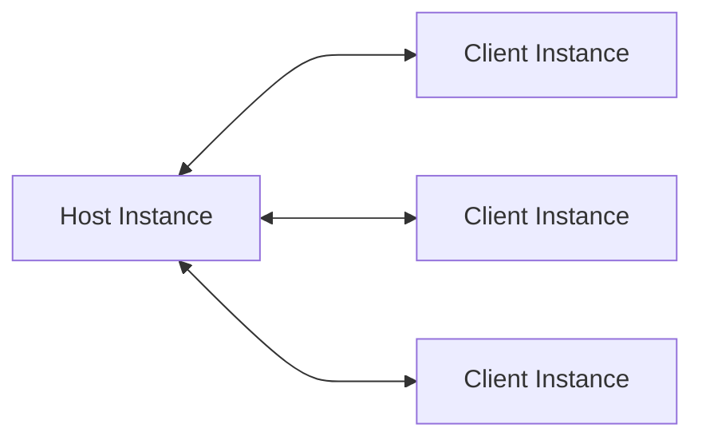

# Quickstart

Clouds Ahoy! Connect was designed to be simple to use, making multiplayer development almost as easy as building a singleplayer game.

This quickstart guide provides an introduction to the core elements of the library.

## Concepts

The following section discusses some of the fundamental concepts employed in Clouds Ahoy! Connect. It is important to understand these concepts as they can have a significant impact on the architecture of the game code.

### Network Topology

Clouds Ahoy! Connect uses an authoritative host network topology. In this architecture, all client instances are connected to one host instance that simultaneously acts as a game server while the host player is playing the game.



This is different from a traditional peer-to-peer topology where all client instances communicate with each other, since here client instances only communicate with the host instance. This approach also differs from a dedicated server or listen server topology in that no explicit game server exists. Client and host instances both run the game code with the host instance having authority over when and how functions are invoked.

This topology was chosen for Clouds Ahoy! Connect due to its low cost, as it leverages essentially free peer-to-peer connections, its simple setup, as it does not require any dedicated hardware, and the simplified development, since no dedicated server code has to be written.

There are, however, also disadvantages to this design which include potentially higher latency, as messages between client instances are relayed through the host instance, reliance on the host instance without which the session cannot be continued, and vulnerability to cheating, as the host instance has access and authority over the entire game state.

### Object Matching

To send Network Function calls over the network every object that participates in networking has to be registered. When registering an object it is assigned a unique id. Ids are applied sequentially, it is therefore essential that **objects are registered in the same order on all game instances**. Failing to do so will prevent the library from delivering Network Function calls to the correct objects.

The easiest way of achieving this is by ensuring that all object registrations after the initial scene load happen inside a reliable host authoritative Network Function.

### Consistency

The most challenging task when using Clouds Ahoy! Connect is to ensure that the game state is consistent across all game instances.

Since each game instance runs the game code locally, they all have their own game state which is continuously modified as the game progresses. For players to have a shared experience these separate game states must be as similar as possible. This is done by starting off with the same initial state and performing the same deterministic operations in the same order on all game instances.

In practice, to ensure the same changes are made in the same order on all game instances, make sure that all Network Functions that modify the game state in a meaningful way are configured to be **host authoritative**, sent **reliably** and **received by all game instances**. In order to ensure all game states are the same after an operation avoid randomness or changes based on user input. Instead, pass the result of any random events as arguments to a Network Function to ensure the same result is applied by all game instances.

```c#
// The final damage is determined inside the Network Function
public void OnPlayerHit() {
    Invocation.Invoke(DealDamageToPlayer);
}

// Each game instance will detract a different amount from the player's health
[NetworkFunction(Groups.Host, Recipients.All)]
public void DealDamageToPlayer() {
    Health -= Random.Range(1, 3); // Avoid!
}
```

```c#
// Instead, determine the final damage first and send that to all game instances
public void OnPlayerHit() {
    Invocation.Invoke(DealDamageToPlayer, Random.Range(1, 3));
}

[NetworkFunction(Groups.Host, Recipients.All)]
public void DealDamageToPlayer(float damage) {
    Health -= damage;
}
```

## Using the Library

The following section will take a look at how Clouds Ahoy! Connect can be used to build a multiplayer game. This quickstart guide only covers the most essential features and concepts. For a more detailed view check out documentation inside the library itself or the sample project.

### Initialization

Use the `Session.Builder` to initialize the library and create a new `Session` instance. This instance acts as a facade to access all functions of the library. During the lifetime of the application, only one instance of the library should be created. To use with the Steam peer-to-peer network configure the builder with `ForSteam()`.

```c#
Session.Builder builder = new Session.Builder();
Session session = builder.ForSteam().Build();
```

### Connecting

To establish a network connection create a `NetworkConnectionConfig` and pass it to `EstablishConnection()`. For Steam use the `SteamNetworkConnectionConfig.Builder` to create a new configuration. If the configuration is set as client with `AsClient()` the library will attempt to connect the configured host. When configured as host with `AsHost()` a network socket is opened that listens for incoming client connections.

On the host instance, all client instances that will participate in the session have to be configured. This information is used to only accept legitimate connection requests and to determine when the session establishment is complete.

Game instances are uniquely identified using `NetworkIdentity`. For Steam `SteamNetworkIdentity` can be created from the Steam ID of the corresponding Steam user.

```c#
CSteamID hostSteamId;

SteamNetworkConnectionConfig.Builder builder = new SteamNetworkConnectionConfig.Builder();
SteamNetworkConnectionConfig clientConfig = builder.AsClient(hostSteamId).Build();

session.EstablishConnection(clientConfig);
```

```c#
CSteamID client1SteamId, client2SteamId;

SteamNetworkConnectionConfig.Builder builder = new SteamNetworkConnectionConfig.Builder();
SteamNetworkConnectionConfig hostConfig = builder.AsHost(client1SteamId, client2SteamId).Build();

session.EstablishConnection(hostConfig);
```

> :bulb: For singleplayer sessions, a host configuration can be created without providing any client identities. When doing so no network socket is created and the connection establishment succeeds immediately.

> :bulb: Add a timeout to the connection configuration to have the establishment fail if it cannot be completed in the set amount of time.

### Disconnecting & Resetting

To disconnect from an ongoing session `DropConnection()` can be used. This will close any ongoing connections to other game instances. However, registered objects and the current object id counter are kept intact. To clear all registered objects and reset object ids `Reset()` can be used.

```c#
session.DropConnection();
session.Reset();
```

> :bulb: Always clear all registered objects and restore the initial state before creating a new connection. This prevents registrations from previous sessions from leaking and breaking the object registration order.

### Processing

To collect incoming messages from all ongoing connections `PollConnection()` should be called. To minimize latency the connection should be polled every frame. Polling the connection will gather all incoming Network Function calls and push them onto a queue. To process this queue and invoke all queued Network Functions `ProcessQueuedNetworkFunctionCalls()` can be used.

Incoming calls should be processed as soon as possible to avoid delays. Ideally, `ProcessQueuedNetworkFunctionCalls()` is called right after `PollConnection()`. A good place for this is `LateUpdate()` to process network calls after all other game code is done executing.

```c#
session.PollConnection();
session.ProcessQueuedNetworkFunctionCalls();
```

> :bulb: There are situations where it can make sense to delay polling the connection. For example, when loading a scene or instantiating a structure over multiple frames Network Function calls might be received for objects that are not yet registered. This can be avoided by holding off on polling until all objects are registered.

### Network Events

For important changes to the network connection events are raised. They can be subscribed to through the `OnNetworkConnectionChanged` event delegate. These events can be used to advance the game when a certain state is reached.

```c#
session.OnNetworkConnectionChanged += (sender, args) => {
    switch (args.Type) {
        case NetworkConnectionEventArgs.Types.ConnectionEstablished:
            break;
        case NetworkConnectionEventArgs.Types.ConnectionLost:
            break;
        case NetworkConnectionEventArgs.Types.ConnectionToClientLost:
            break;
        case NetworkConnectionEventArgs.Types.ConnectionEstablishmentFailed:
            break;
    }
};
```

The `ConnectionEstablished` event behaves differently for clients and host instances. On a client instance, it is raised as soon as the connection to the host instance has been established. On the host instance, the event is only raised when _all_ expected client instances are connected. This can cause the different game instances to receive the `ConnectionEstablished` event at different times.

> :bulb: To start the game at the same time on all game instances the host can send a Network Function call as soon as all client game instances are connected.

The `ConnectionEstablishmentFailed` event is raised when any connection fails during establishment or the connection establishment timed out.

The `ConnectionToClientLost` event is only raised on the host instance and indicates that the connection to a client instance was disrupted. This has no impact on the other members of the sessions, however, it might be appropriate to remove the corresponding player character from the game.

### Network Objects

Every object that participates in networking must be marked as a Network Object using the `[NetworkObject]` attribute. There are two reasons why an object should be a Network Object. The primary reason is because the object contains Network Functions which should be invoked across all connected game instances. The second reason is that the object is passed as an argument to a Network Function.

When passing a Network Object as an argument to a Network Function on each game instance the function is invoked with the corresponding instance of the Network Object on that particular game instance.

```c#
[NetworkObject]
public class Egg {

    public float Weight { get; set; }
}
```

Before a Network Object can be used it has to be registered. When registering a Network Object it is assigned a unique id by which the object is identified on all game instances. Because ids are assigned sequentially it is essential that all Network Objects are registered in the same order on all game instances.

> :bulb: When talking about objects, this guide is referring to C# objects, not Game Objects. One Game Object can contain multiple Network Objects in the form of behavior scripts. Each of these Network Objects has to be registered separately.

To register a Network Object the `Register`, `RegisterGameObject` and `RegisterInstance` extension functions can be used. `Register` can be called on Game Objects and registers all components of that Game Object. `RegisterGameObject` has the same effect as `Register` but can be called on components instead of Game Objects.

```c#
SpriteRenderer spriteRenderer;

// These two calls have the same effect
spriteRenderer.RegisterGameObject();
spriteRenderer.gameObject.Register();
```

Finally, `RegisterInstance` can be used to register an individual Network Object.

> :bulb: Calling `RegisterInstance` on a component will register only that component. Other components on the same Game Object will not be registered.

### Network Functions

To have a function be invoked on all connected game instances, it has to be marked as a Network Function using the `[NetworkFunction]` attribute. All instance methods can be marked as Network Functions, regardless of their accessibility.

The arguments passed to the Network Function attribute determine which game instances have the authority to call the function and on which game instances a function call should be invoked. This makes it possible to define what effect each Network Function can have on an instance's game state.

They also allow determining how the call should be transmitted. Most calls should be transmitted reliably, to ensure they are executed on all recipient game instances in the same order. For some calls, it can, however, be acceptable to leverage an unreliable transmission e.g. for regular positional updates.

> :bulb: Network Functions that modify the game state should always be configured with authority `Host`, recipients `All`, and transmission `Reliable`. This ensures that only the host instance can initiate a change and that all game instances apply changes in the same order.

> :bulb: Sometimes other authorities and recipients are appropriate. User input, for example, can be sent from any game instance but should only be processed by the host instance which can make the necessary changes to the game state. Position updates for each player character might also be sent from the corresponding client instances and applied by all game instances. This reduces latency for client user input and makes the game feel more responsive.

```c#
[NetworkObject]
public class Chicken {

    public Egg Egg {get; set;}

    [NetworkFunction(Groups.Host, Recipients.All, Transmission.Reliable)]
    public void LayEgg() {
        // Make sure to register new Network Objects
        Egg = new Egg.RegisterInstance();
        ...
    }

    [NetworkFunction(Groups.All, Recipients.Others)]
    public void WalkToPosition(Vector2 position, float speed) {
        // Network Functions are transmitted reliably as default
        ...
    }

    [NetworkFunction(Groups.Clients, Recipients.Host)]
    private void HatchEgg(Egg egg) {
        // Arguments must be primitive, serializable or Network Objects
        ...
    }
}
```

To call a Network Function and have it be invoked on all recipient instances the `Invocation.Invoke()` static functions can be used. For a function without parameters, call `Invocation.Invoke()` on any object instance, usually `this`, and pass the Network Function as argument. For functions with one parameter, call `Invocation.Invoke()` on the argument and again pass the Network Functions. For functions with multiple parameters, `Invocation.Invoke()` is called on a `Tuple` containing all the arguments in the same order as they appear in the corresponding Network Function.

```c#
Chicken chicken;

Invocation.Invoke(chicken.LayEgg);

// Function arguments are passed after the reference to the network function
Invocation.Invoke(chicken.HatchEgg, chicken.Egg);
Invocation.Invoke(chicken.WalkToPosition, new Vector2(4, 9), 12f);
```

> :bulb: Because the library does not use code generation, calling a Network Function directly without `Invocation.Invoke()` will invoke the function as usual, only on the current game instance.

### Debugging

Debugging multiplayer code can be challenging. Implementation errors can lead to divergence between the game states of each instance and differences in the registration order of Network Objects will prevent Network Function calls from being delivered to the correct objects.

One tool to help discover such errors is snapshots. Snapshots track and collect information about outgoing and incoming Network Function calls and Network Object registrations.

To start collecting this data `StartRecordingSnapshot()` should be called. Network data will be collected until `StopRecordingAndCollectSnapshot()` is called, which returns the recorded snapshots.

## Discussion

The following section takes a closer look at some patterns, tradeoffs, and thoughts that cover certain parts of the library and may be useful during development.

### Validation and Execution Pattern

When writing multiplayer code it is often desired to allow any game instance to call a certain Network Function. However, often times these functions should only be executed when certain conditions are met. Checking the conditions before the call is no option, as a client instance might only have access to outdated information.

A useful pattern to deal with these situations is to split the function into a validation and an execution part. The validation Network Function can be called by any game instance but is only invoked on the host instance. Inside the validation function, the necessary conditions are checked. If they are met, the execution Network Function is called. The execution can only be called by the host instance but is invoked on all game instances. Inside the execution Network Function, the actual changes to the game state are performed.

With this pattern, any game instance can initiate a change of the game state, but only the authoritative host instance decides if the change should actually be made.

```c#
[NetworkObject]
public class Farmer {

    [NetworkFunction(Groups.All, Recipients.Host)]
    public void ValidateCollectEgg(Egg egg) {
        // The host instance validates that the call can be executed
        if (egg.CanBeCollected) Invocation.Invoke(ExecuteCollectEgg, egg)
    }

    [NetworkFunction(Groups.Host, Recipients.All)]
    public void ExecuteCollectEgg(Egg egg) {
        // All game instances update their game states with the approved change
        ...
    }
}
```

> :bulb: A common use case for this pattern is user input. User input is only received on the respective game instance. Often times the user input requires the game state to be updated. The validation and execution pattern can be one way of ensuring the same changes are applied on all instances.

### Deferred Network Functions

To ensure the game states on all game instances evolve in the same way, it is usually required that the same operations are executed in the same order. This can be problematic when Network Function calls are nested or embedded into other code.

By default, a Network Function call is invoked immediately on the calling game instance. This is the expected behavior in most cases, as any changes made by the Network Function become visible immediately. On the other game instances, however, the Network Function is invoked later, when the incoming messages are processed. This can lead to divergence in game state if the Network Function changes the game state in a way that alters the behavior of the code that is executed after the call.

```c#
[NetworkObject]
public class Sprinkler {

    private bool IsFilledWithWater {get; set;} = true;

    [NetworkFunction(Groups.Host, Recipients.All)]
    private void WaterSurroundingPlants() {
        ...
        // On the host instance this is executed immediately
        // On client instances the invocation is skipped
        Invocation.Invoke(ConsumeWater);

        // Only on the host this will be fulfilled
        if (!IsFilledWithWater) FillWithWater();
    }

    [NetworkFunction(Groups.Host, Recipients.All)]
    private void ConsumeWater() {
        // This is invoked at different points in the execution on host and clients
        IsFilledWithWater = false;
    }

    private void FillWithWater() {
        // This is invoked only on the host instance
        ...
    }
}
```

> :bulb: The example above can easily be fixed in three ways. One solution is to place the Network Function call to `ConsumeWater()` after the if-check. With this approach `FillWithWater()` would not be called. Alternatively `FillWithWater()` could also be made a Network Function so it is invoked on all game instances. Finally, `ConsumeWater()` could be made deferred so it is invoked at a later point in time.

The best way of avoiding such issues is to place Network Function calls at the end. There are, however, situations where this is not possible or wanted. For these scenarios, the Network Functions have an additional property `IsDeferred`. A deferred Network Function will not be invoked immediately on the calling game instance. Instead, it will be invoked during the processing of all other incoming Network Functions.

```c#
[NetworkObject]
public class Sprinkler {

    private bool IsFilledWithWater {get; set;} = true;

    [NetworkFunction(Groups.Host, Recipients.All)]
    private void WaterSurroundingPlants() {
        ...
        // This invocation is now skipped on all game instances
        Invocation.Invoke(ConsumeWater);
        if (!IsFilledWithWater) FillWithWater();
    }

    [NetworkFunction(Groups.Host, Recipients.All)]
    private void WaterSurroundingPlantsUntilEmpty() {
        // This is an infinite loop because condition is not modified immediately
        while (IsFilledWithWater) {
            Invocation.Invoke(WaterSurroundingPlants);
        }
    }

    [NetworkFunction(Groups.Host, Recipients.All, isDeferred = true)]
    private void ConsumeWater() {
        // Because it is deferred, this is invoked at the same time on all instances
        IsFilledWithWater = false;
    }

    private void FillWithWater() {
        ...
    }
}
```

> :bulb: When using deferred Network Functions beware that their effects will not be visible immediately. This can lead to difficult bugs where checks are passed because their underlying values are not yet updated.

### Reconnecting

At this point, there is no supported way of allowing a disconnected client game instance to reconnect to a running session. Because Clouds Ahoy! Connect ensures consistent game states by replicating Network Function calls across instances, it is not necessary to define the game state as a data structure. This, however, makes reconnecting more challenging. To resynchronize a reconnected client instance it either requires the complete game state or all the changes that were made since the disconnect. Both approaches would require significant additional work from the development team and would have to be taken into consideration when writing the game code. This goes against the idea of making the development as straightforward as possible. Consequently, the current approach to deal with disconnects is to gracefully remove the disconnected player from the game and to provide the players an option to restart the session from a synchronized point.
