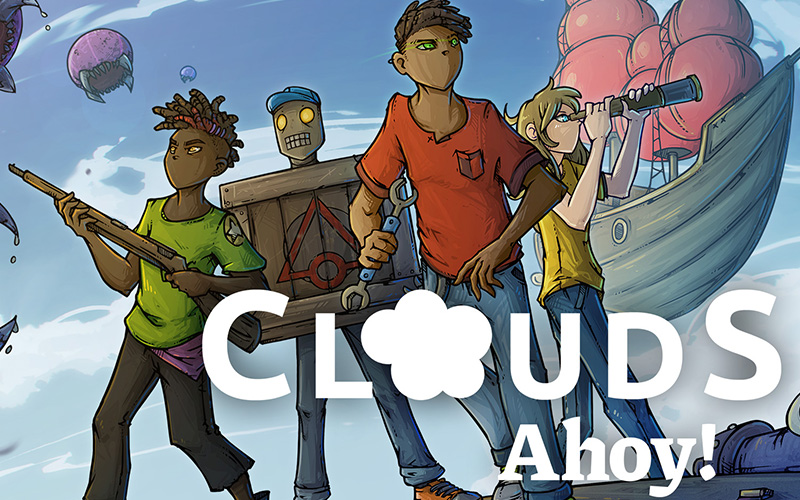

# Clouds Ahoy! Connect

**Networking Library for Unity + Steamworks**

_Clouds Ahoy! Connect_ is a minimalistic [Unity](https://unity.com/) package and library that simplifies the development of peer-to-peer multiplayer games. The library currently only supports the Steam peer-to-peer network, building upon the [Steamworks.Net](https://steamworks.github.io/) wrapper for Valve's Steamworks API, but can be extended for other networking stacks. It was designed with simplicity in mind, to enable even the smallest teams to create realtime multiplayer experiences without spending most of their resources on networking.

Clouds Ahoy! Connect is built around the concept of [remote procedure calls](https://en.wikipedia.org/wiki/Remote_procedure_call). Any function in the code can be declared a _Network Function_. When a Network Function is called it is invoked simultaneously on all connected game instances. **With this, the code can be written almost as if it was a singleplayer game.** Whenever the host game instance encounters a Network Function, the library transmits the call to all the client game instances. When a client game instance reaches a Network Function it resumes without invoking the function, delaying the call until the corresponding message coming from the host game instance has arrived.

With this approach the same Network Functions with the same arguments are invoked on all game instances in the same order at approximately the same time. Resulting in a synchronized experience on all connected game instances.

For a more complete introduction check out the [quickstart guide](./QUICKSTART.md).

## Games

Clouds Ahoy! Connect was originally developed for the frantic coop multiplayer game [Clouds Ahoy!](https://store.steampowered.com/app/2196870/Clouds_Ahoy/).

[](https://store.steampowered.com/app/2196870/Clouds_Ahoy/)

## Installation

To use Clouds Ahoy! Connect, first install [Steamworks.Net](https://steamworks.github.io/) by following the [official installation instructions for Unity](https://steamworks.github.io/installation/).

Next install Clouds Ahoy! Connect [from its git URL via the package manager](https://docs.unity3d.com/Manual/upm-ui-giturl.html).

## Hello world

```c#
public class Game : MonoBehaviour {

    private Session Session { get; set; }

    public void Initialize(CSteamID remoteSteamId) {

        // Assuming there exists one chicken in the scene, register it as a Network Object
        // Network Objects have to be registered on all game instances in exactly the same order
        FindObjectOfType<Chicken>().RegisterGameObject();

        // Initialize Clouds Ahoy! Connect by creating a new session instance from the builder
        Session = new Session.Builder().ForSteam().Build();

        // Register a callback to be notified about changes in the network connection
        Session.OnNetworkConnectionChanged += OnNetworkConnectionChanged;

        // Define the connection by creating a configuration instance from the builder
        // The configuration determines whether the instance acts as the host or a client game instance
        var connectionConfig = new SteamNetworkConnectionConfig.Builder().AsHost(remoteSteamId).Build();

        // Establish a connection with the other game instances
        Session.EstablishConnection(connectionConfig);
    }

    public void OnNetworkConnectionChanged(object sender, NetworkConnectionEventArgs args) {

        // Check the event type to learn what happened on the network connection
        if (args.Type == NetworkConnectionEventArgs.Types.ConnectionEstablished) {

            var chicken = FindObjectOfType<Chicken>();

            // Wrap the function arguments and send them on the network to the target Network Function
            // This will invoke the Network Function on all connected game instances
            Invocation.Invoke(chicken.LayEgg, new Vector2(5, 8), 12f);
        }
    }

    public void LateUpdate() {

        // Poll the connection, collecting all incoming messages
        Session.PollConnection();

        // Invoke all Network Function calls that were received on the network or queued locally
        Session.ProcessQueuedNetworkFunctionCalls();
    }
}
```

```c#
// Objects that participate in networking must be marked as Network Objects
[NetworkObject]
public class Chicken : MonoBehaviour {

    // Functions that should be invoked on remote game instances must be marked as Network Functions
    // The arguments specify which instances can call the the function and on which instances it is invoked
    [NetworkFunction(Groups.Host, Recipients.All)]
    public void LayEgg(Vector2 location, float size) {

        Debug.Log("Hooray, I've laid an egg on all game instances");
    }
}
```

## Samples

The Clouds Ahoy! Connect package contains samples which can be imported through the Unity package manager after installing the Clouds Ahoy! Connect package via Git.

### Block Buster

The **Block Buster** sample provides a minimal setup demonstrating how Clouds Ahoy! Connect can be used with Steamworks.Net.

To try it out make sure to have a valid `steam_appid.txt` file at the root of your Unity project as described by the [Steamworks.Net installation guide](https://steamworks.github.io/installation/). Also, all Steam accounts used for testing must have the game with the corresponding app id in their library.

## Credits

If you use Clouds Ahoy! Connect in your game please mention it in the credits and reach out to have the game added to this readme.
